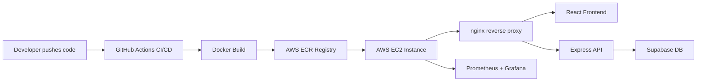
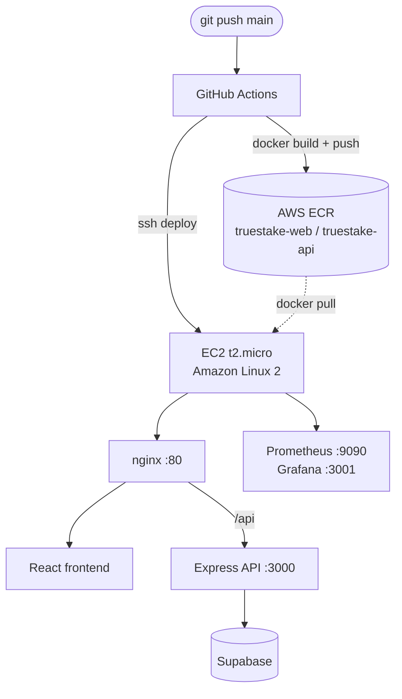

<div align="center">

# 🎲 TRUESTAKE

### Predict. Bet. Win.

The most premium hardcore dark prediction-market platform — bet on crypto,
stocks, IPL, forex and viral tweets in real time.

</div>

---

## Stack

| Layer        | Tech                                                        |
| ------------ | ---------------------------------------------------------- |
| Monorepo     | Turborepo + pnpm workspaces                                |
| Frontend     | Vite · React · TypeScript · Tailwind · framer-motion       |
| Backend      | Node · Express · TypeScript                                |
| Database     | Supabase (Postgres + Auth + Realtime)                      |
| Wallet       | MetaMask via ethers v6                                     |
| Charts / FX  | Recharts · tsParticles · canvas-confetti · Howler          |
| Observability| prom-client · Sentry · Prometheus · Grafana               |
| Infra        | Docker · Kubernetes · Helm · ArgoCD · GitHub Actions       |

## Quick start

```bash
pnpm install

# copy env templates and fill in your keys
cp apps/api/.env.example apps/api/.env
cp apps/web/.env.example apps/web/.env

# run web (http://localhost:5173) + api (http://localhost:3000)
pnpm dev
```

> The live-data endpoints fall back to realistic mock data when third-party API
> keys are missing, so the app runs end-to-end out of the box.

### Database

Run `apps/api/supabase/migrations/0001_init.sql` in the Supabase SQL editor
(or `supabase db push`) to create the schema, RLS policies and the wallet
provisioning trigger.

## Structure

```
apps/web      Frontend SPA
apps/api      REST API
packages/*    Shared types + tsconfig
k8s/          Manifests + Helm chart
argocd/       GitOps Application
.github/      CI/CD + project context (CLAUDE.md)
```

## Scripts

```bash
pnpm dev         # everything
pnpm build       # turbo build all
pnpm typecheck   # tsc across the repo
pnpm lint
pnpm test
```

## Deployment

Three supported paths — pick one (or run all three):

| Target | What | Config |
| ------ | ---- | ------ |
| **AWS (Docker)** | Full stack on a single EC2 box, images in ECR, CI/CD via GitHub Actions | `docker-compose.yml`, `.github/workflows/deploy-aws.yml`, `scripts/*` |
| **Netlify** | Frontend SPA | `netlify.toml` |
| **Vercel** | API (serverless — see caveat) | `apps/api/vercel.json` |

### Architecture


```mermaid
graph LR
  A[Developer pushes code] --> B[GitHub Actions CI/CD]
  B --> C[Docker Build]
  C --> D[AWS ECR Registry]
  D --> E[AWS EC2 Instance]
  E --> F[nginx reverse proxy]
  F --> G[React Frontend]
  F --> H[Express API]
  H --> I[Supabase DB]
  E --> J[Prometheus + Grafana]
```

> **Flow:** GitHub → GitHub Actions → Docker Build → AWS ECR → AWS EC2 → nginx → users.
> nginx serves the React build and reverse-proxies `/api` to the Express container;
> the API talks to hosted Supabase; Prometheus + Grafana run alongside for metrics.

---

### 🐳 Local Docker

```bash
# Dev (hot reload — mounts source, runs tsx watch + vite):
docker-compose up

# Production stack (web :80, api :3000, prometheus :9090, grafana :3001):
docker-compose -f docker-compose.yml up -d --build
```

Secrets are read from `apps/api/.env` (`env_file`). The web image is built with
no `VITE_API_URL` so the SPA calls relative `/api`, which nginx proxies to the
api container on the `truestake-network`.

---

### ☁️ AWS Deployment

**Architecture:** GitHub Actions → ECR (container registry) → EC2 (runs containers) → nginx (serves frontend + proxies API).


```mermaid
flowchart TD
  Dev([git push main]) --> GA[GitHub Actions]
  GA -->|docker build + push| ECR[(AWS ECR<br/>truestake-web / truestake-api)]
  GA -->|ssh deploy| EC2[EC2 t2.micro<br/>Amazon Linux 2]
  ECR -. docker pull .-> EC2
  EC2 --> NGINX[nginx :80]
  NGINX --> WEB[React frontend]
  NGINX -->|/api| API[Express API :3000]
  API --> SUPA[(Supabase)]
  EC2 --> MON[Prometheus :9090<br/>Grafana :3001]
```

#### Steps to deploy

1. Create an AWS account, install the AWS CLI, run `aws configure`.
2. Run **`scripts/aws-setup.sh`** — creates the `truestake-web` / `truestake-api` ECR repos and the `truestake-sg` security group (opens 22, 80, 443, 3000).
3. Launch an **EC2 t2.micro** (Amazon Linux 2) and attach the **`truestake-sg`** security group.
4. SSH in: `ssh -i key.pem ec2-user@<EC2_IP>`
5. Run **`scripts/ec2-init.sh`** on the box (installs Docker + docker-compose + AWS CLI, logs in to ECR). Then create `apps/api/.env` on the host with your real keys, and copy `docker-compose.yml` + `prometheus.yml` to `/home/ec2-user/truestake/`.
6. Add **GitHub Secrets** (repo → Settings → Secrets → Actions):
   - `AWS_ACCESS_KEY_ID`, `AWS_SECRET_ACCESS_KEY`, `AWS_REGION=ap-south-1`
   - `EC2_HOST` (public IP/DNS), `EC2_SSH_KEY` (the private `.pem` contents)
   - `VITE_SUPABASE_URL`, `VITE_SUPABASE_ANON_KEY`, `VITE_VAPID_PUBLIC_KEY`, `VITE_RAZORPAY_KEY_ID` (baked into the web build)
7. **Push to `main`** → GitHub Actions builds both images, pushes to ECR, SSHes into EC2, pulls + `docker-compose up -d --force-recreate`, and pings `/health` to confirm.

---

### 🌐 Netlify (frontend) + Vercel (API)

**Netlify** — connect the repo, Netlify reads `netlify.toml` (build `apps/web`, publish `apps/web/dist`, SPA redirects). Set `VITE_*` env vars in the UI, pointing `VITE_API_URL` at your API URL.

**Vercel** — import `apps/api`, Vercel reads `apps/api/vercel.json` and serves the Express app via `apps/api/api/index.ts`.

> ⚠ **Caveat:** Vercel functions are stateless/short-lived, so the API's
> background loops (bet auto-settlement, price alerts) do **not** run there. On
> Vercel they're driven by the `crons` in `vercel.json` hitting cron endpoints.
> For the loops to "just work", run the API on a long-lived host — the **AWS/Docker
> deploy above**, or Render / Railway / Fly.io.

---

<div align="center"><sub>© TrueStake · Built dark.</sub></div>
